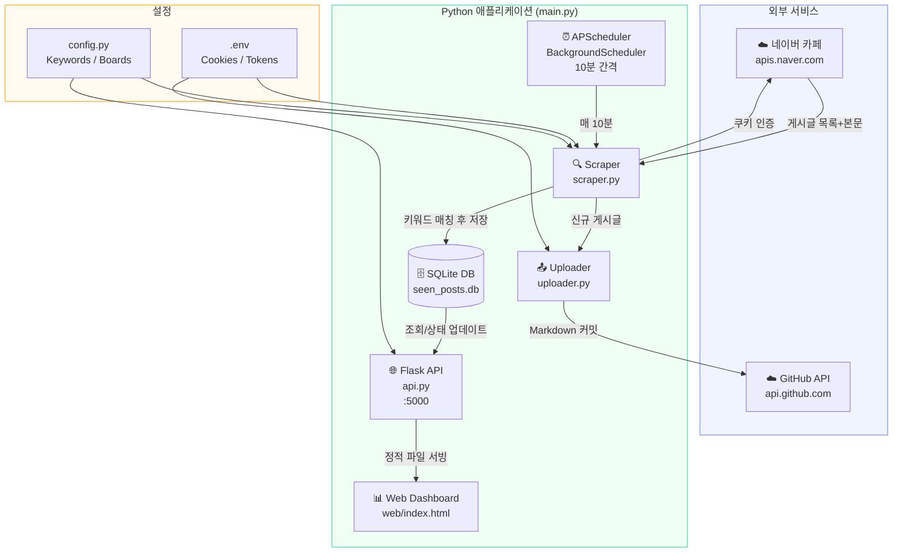
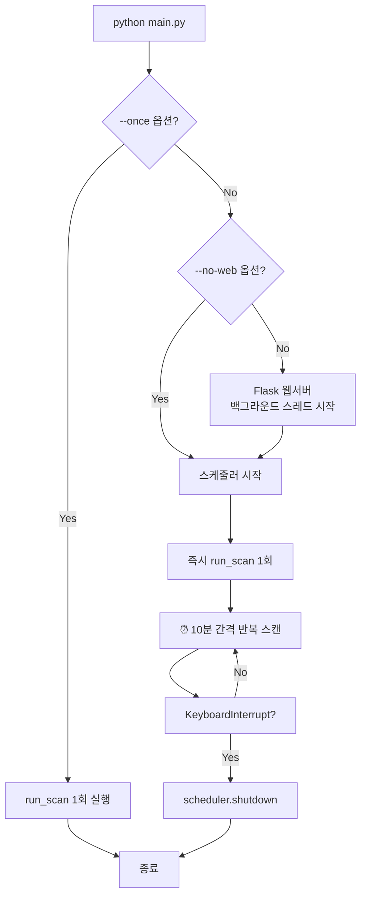
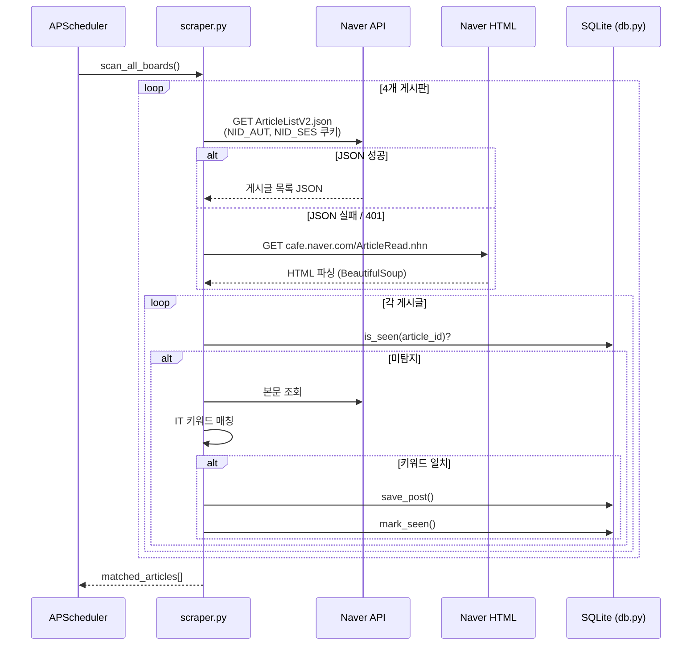
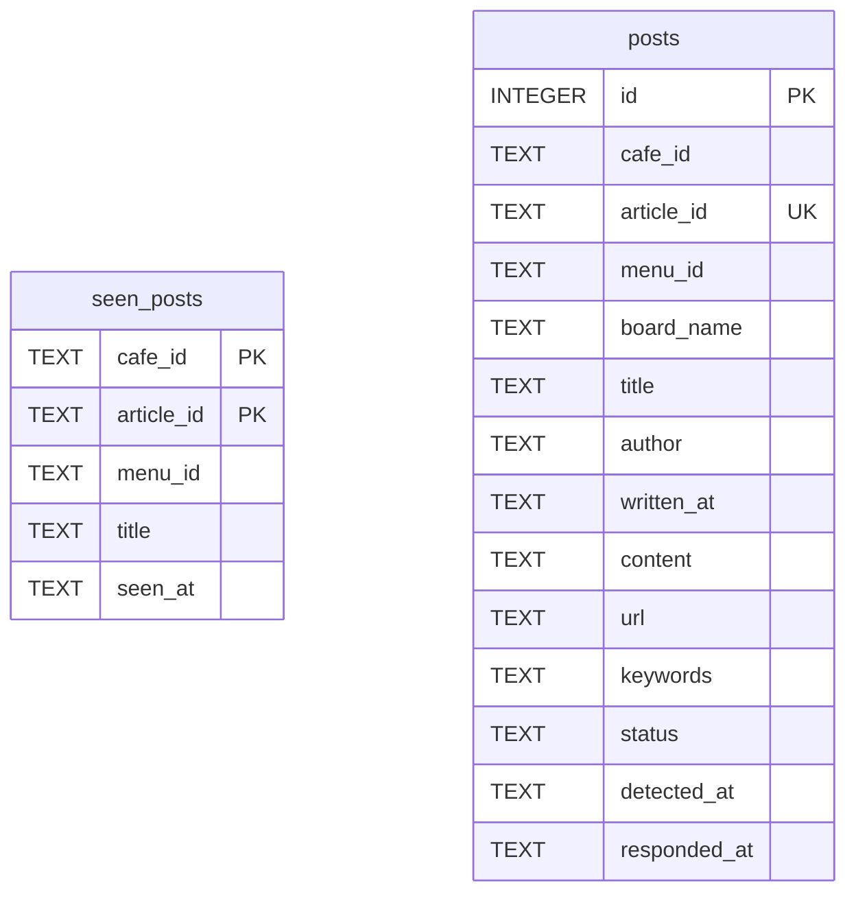
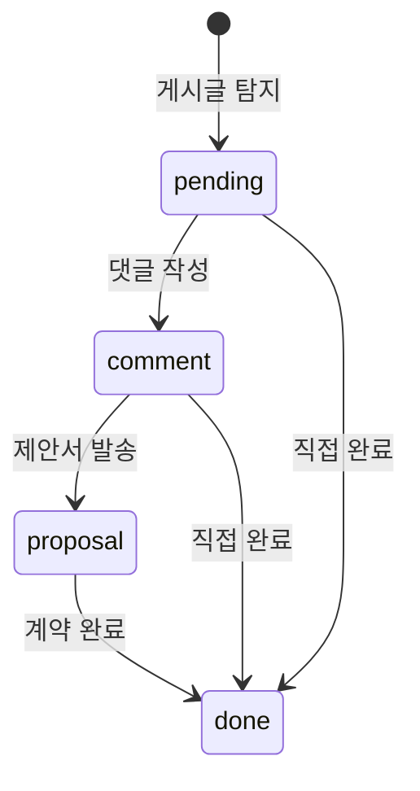
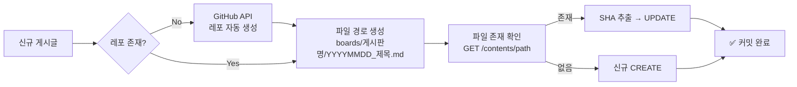
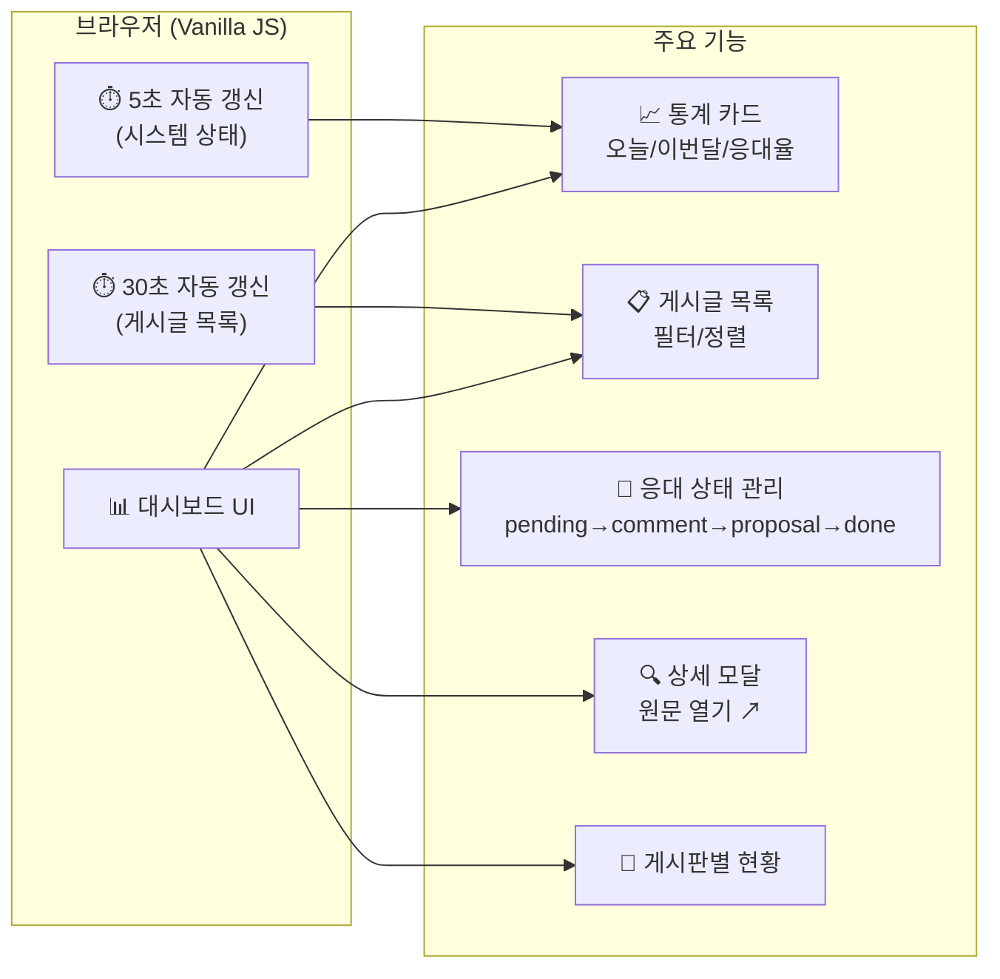
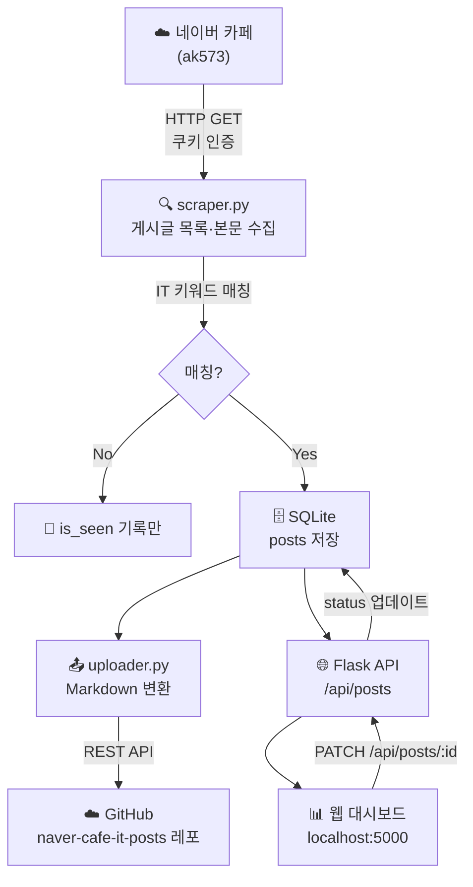
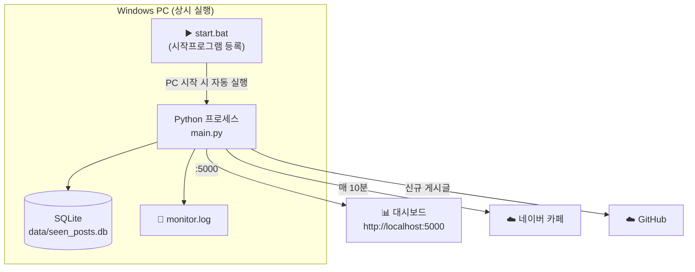

# 아키텍처 문서 — 네이버 카페 IT 교육 게시글 모니터

> 버전: 1.0 · 최종 수정: 2026-03-20

---

## 1. 시스템 개요

네이버 카페(ak573)의 4개 게시판을 10분마다 자동 순회하여 **IT 교육 관련 키워드**가 포함된 게시글을 탐지하고, GitHub에 마크다운으로 아카이빙한 뒤 웹 대시보드에서 영업팀이 응대 상태를 추적할 수 있는 모니터링 시스템입니다.

---

## 2. 전체 시스템 아키텍처



---

## 3. 컴포넌트별 상세

### 3-1. 진입점 — `main.py`



**CLI 옵션**

| 옵션 | 기본값 | 설명 |
|------|--------|------|
| `--once` | false | 즉시 1회 스캔 후 종료 |
| `--no-web` | false | 웹 서버 없이 스캔만 실행 |
| `--port` | 5000 | 웹 서버 포트 |
| `--interval` | 10 | 폴링 주기(분) |

---

### 3-2. 스크래퍼 — `scraper.py`



**모니터링 게시판**

| 게시판 ID | 게시판 이름 |
|-----------|-------------|
| 530 | 교육훈련 |
| 14 | 교육기획 |
| 334 | 강사추천 |
| 3 | 자유게시판 |

---

### 3-3. 데이터베이스 — `db.py`



**응대 상태(status) 흐름**



---

### 3-4. GitHub 업로더 — `uploader.py`



---

### 3-5. REST API — `api.py`

| 메서드 | 경로 | 설명 |
|--------|------|------|
| `GET` | `/` | 대시보드 HTML 서빙 |
| `GET` | `/api/stats` | 오늘/이번달 통계, 게시판별 현황 |
| `GET` | `/api/posts` | 게시글 목록 (필터: menu_id, status) |
| `GET` | `/api/posts/<id>` | 게시글 상세 |
| `PATCH` | `/api/posts/<id>` | 응대 상태 변경 |
| `GET` | `/api/system` | 마지막/다음 스캔 시간 |

---

### 3-6. 웹 대시보드 — `web/index.html`



---

## 4. 데이터 흐름 전체



---

## 5. 배포 구조



---

## 6. 설정 파일

### `.env`

```env
NAVER_NID_AUT=<네이버 인증 쿠키>
NAVER_NID_SES=<네이버 세션 쿠키>
GITHUB_TOKEN=<GitHub Personal Access Token>
GITHUB_USERNAME=<GitHub 사용자명>
GITHUB_REPO=naver-cafe-it-posts
POLL_INTERVAL_MINUTES=10   # 선택, 기본 10분
```

### `config.py` 주요 상수

| 상수 | 기본값 | 설명 |
|------|--------|------|
| `CAFE_ID` | `10733571` | 모니터링 대상 카페 ID |
| `POLL_INTERVAL_MINUTES` | `10` | 스캔 주기(분) |
| `IT_KEYWORDS` | 40여 개 | 탐지 키워드 목록 |

---

## 7. 기술 스택

| 영역 | 기술 |
|------|------|
| 언어 | Python 3.11+ |
| 스케줄러 | APScheduler 3.x (BackgroundScheduler) |
| HTTP 클라이언트 | requests + BeautifulSoup4 |
| 웹 프레임워크 | Flask 3.x |
| 데이터베이스 | SQLite 3 (WAL 모드) |
| 프론트엔드 | Vanilla JS (ES2022), CSS Grid/Flexbox |
| 외부 연동 | Naver Cafe Internal API, GitHub REST API v3 |
| 실행 환경 | Windows 11, 시작프로그램 BAT 자동 실행 |

---

## 8. 디렉토리 구조

```
naver_cafe_monitor/
├── main.py           # 진입점 — 스케줄러 + Flask 통합 실행
├── config.py         # 환경변수 로드, 키워드/게시판 설정
├── scraper.py        # 네이버 카페 스크래핑 (JSON API + HTML fallback)
├── db.py             # SQLite 데이터 레이어
├── api.py            # Flask REST API
├── uploader.py       # GitHub 마크다운 업로더
├── web/
│   └── index.html    # 웹 대시보드 (SPA)
├── mockup/
│   └── index.html    # 초기 UI 목업 (참고용)
├── data/
│   └── seen_posts.db # SQLite 데이터베이스
├── .env              # 비밀 설정 (git 제외)
├── requirements.txt  # Python 의존성
├── start.bat         # Windows 실행 스크립트
├── monitor.log       # 실행 로그
├── PRD.md            # 제품 요구사항 문서
├── PLAN.md           # 개발 계획 문서
└── ARCHITECTURE.md   # 현재 파일
```
